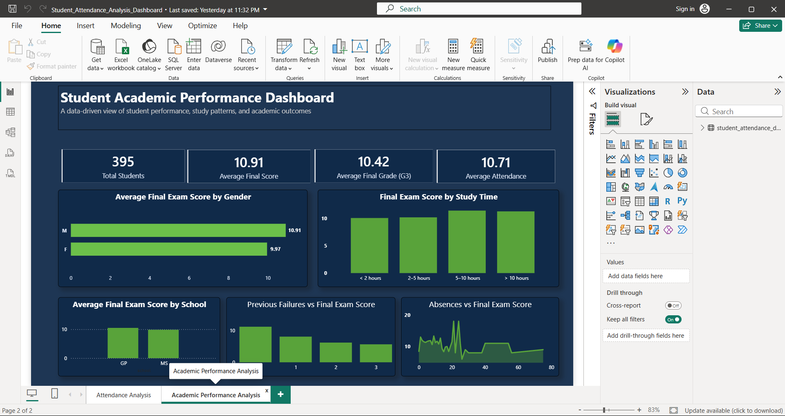
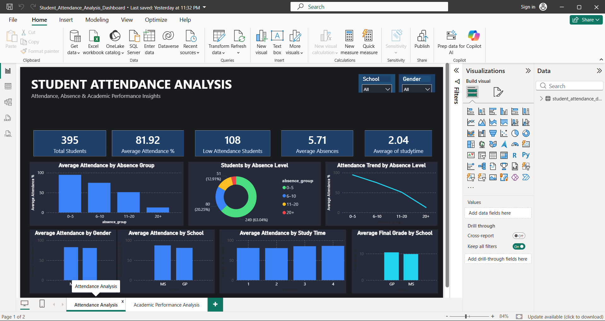

# 📊 Student Attendance & Academic Performance Analysis

An end-to-end data analytics project focused on analyzing **student attendance and academic performance** using **Python, SQL, and Power BI**.

The project explores attendance patterns, absence levels, demographic differences, study-time trends, and academic performance to identify meaningful insights from student data.

---

## 🎯 Project Objective

The objective of this project is to analyze student attendance and academic performance and understand how different factors are associated with student outcomes.

The project covers:

- Data cleaning and preprocessing
- Exploratory Data Analysis (EDA)
- SQL-based data analysis
- Attendance analysis
- Academic performance analysis
- Interactive Power BI dashboards
- Business-style insights and visualizations

---

## 🛠️ Tools & Technologies

- **Python**
  - Pandas
  - NumPy
  - Matplotlib
- **SQL**
  - MySQL
- **Power BI**
  - Data visualization
  - KPI cards
  - Interactive filters
  - DAX measures
- **Jupyter Notebook**
- **Git & GitHub**

---

## 📁 Project Structure

```text
Student Attendance Analysis Dashboard/
│
├── dashboard/
│   └── Student_Attendance_Analysis_Dashboard.pbix
│
├── notebook/
│   └── student_attendance_analysis.ipynb
│
├── processed_data/
│
├── raw_data/
│   └── archive/
│       ├── Maths.xlsx
│       └── Portuguese.xlsx
│
├── sql/
│
├── .gitignore
└── README.md
```

---

## 🔄 Project Workflow

```text
Raw Data
   ↓
Data Cleaning & Preprocessing
   ↓
Exploratory Data Analysis
   ↓
SQL Analysis
   ↓
Power BI Data Modeling
   ↓
Dashboard Development
   ↓
Insights & Findings
```

---

## 🐍 Python & EDA

Python was used for data preparation, cleaning, exploration, and analysis.

Key activities included:

- Inspecting the dataset
- Handling missing values
- Checking duplicate records
- Understanding data types
- Statistical analysis
- Attendance analysis
- Academic performance analysis
- Identifying patterns and relationships between variables

The analysis was performed using **Pandas, NumPy, and Matplotlib**.

---

## 🗄️ SQL Analysis

SQL was used to perform structured analysis on the student dataset.

The SQL analysis covers concepts such as:

- Filtering data using `WHERE`
- Aggregations using `GROUP BY`
- Filtering aggregated results using `HAVING`
- `INNER JOIN`
- `LEFT JOIN`
- Subqueries
- Attendance analysis
- Academic performance analysis

---

## 📊 Dashboard

The Power BI dashboards provide an interactive view of student attendance and academic performance.

### 🎓 Student Academic Performance Dashboard



### 📅 Student Attendance Dashboard



---

## 📌 Dashboard Analysis

The dashboards provide insights into:

- Total number of students
- Average attendance percentage
- Low attendance students
- Average absences
- Attendance patterns by absence level
- Attendance comparison by gender and school
- Attendance trends by study time
- Academic performance by school

---

## ⭐ Key Dashboard Features

- Interactive school and gender filters
- KPI cards for important attendance metrics
- Attendance analysis by absence group
- Student distribution by absence level
- Academic performance comparison
- Attendance trend analysis
- Dark-themed professional dashboard design
- Interactive Power BI visualizations

---

## 💡 Key Insights

- Overall student attendance was approximately **81%**.
- Students with higher absence levels showed substantially lower attendance.
- A significant portion of students belonged to the **0–5 absence group**.
- Attendance patterns varied across different student groups.
- The dashboards help identify students and groups requiring closer academic attention.

---

## 📈 Business Value

The analysis can help educational institutions:

- Monitor student attendance
- Identify low-attendance students
- Understand attendance patterns
- Compare academic performance across groups
- Identify potential areas requiring intervention
- Support data-driven academic monitoring

---

## 📂 Dataset

The project uses student academic and attendance-related data containing demographic, academic, and attendance information.

The raw datasets are maintained separately from the processed data to keep the project structure organized.

---

## 🚀 Future Improvements

Possible future enhancements include:

- Adding automated attendance tracking
- Building predictive models for student performance
- Identifying students at risk of poor academic outcomes
- Adding more interactive Power BI pages
- Creating automated data refresh pipelines
- Developing a student performance prediction model using Machine Learning

---

## 👩‍💻 Author

**Srabani Banerjee**

Data Analytics Project | Python | SQL | Power BI
